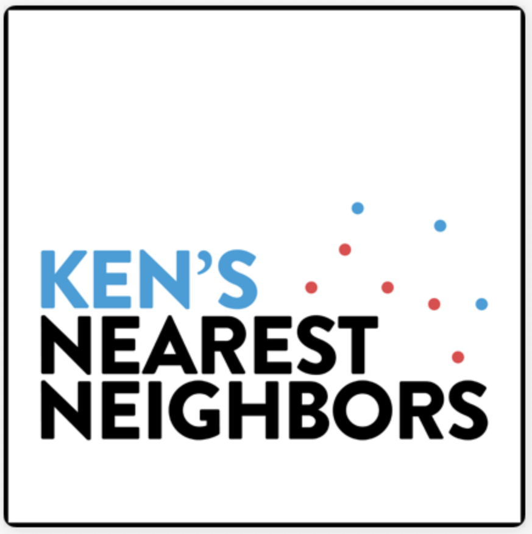
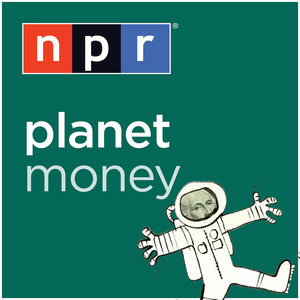

### Howdy

 

**Who am I?**

💻 I'm a graduate student studying AI and Machine Learning. Currently interested in ML Deployment, Data Visualization and more.

⚕️ My background is in public health, medicine and sociology. Ask me about it!

 

**What do I like?** 

☕ A nice cold brew. 

🏃 Running with the dog.

🎵 Send me your k-pop.

🎧 Podcasts: 

 

**Other**

  
  
  

