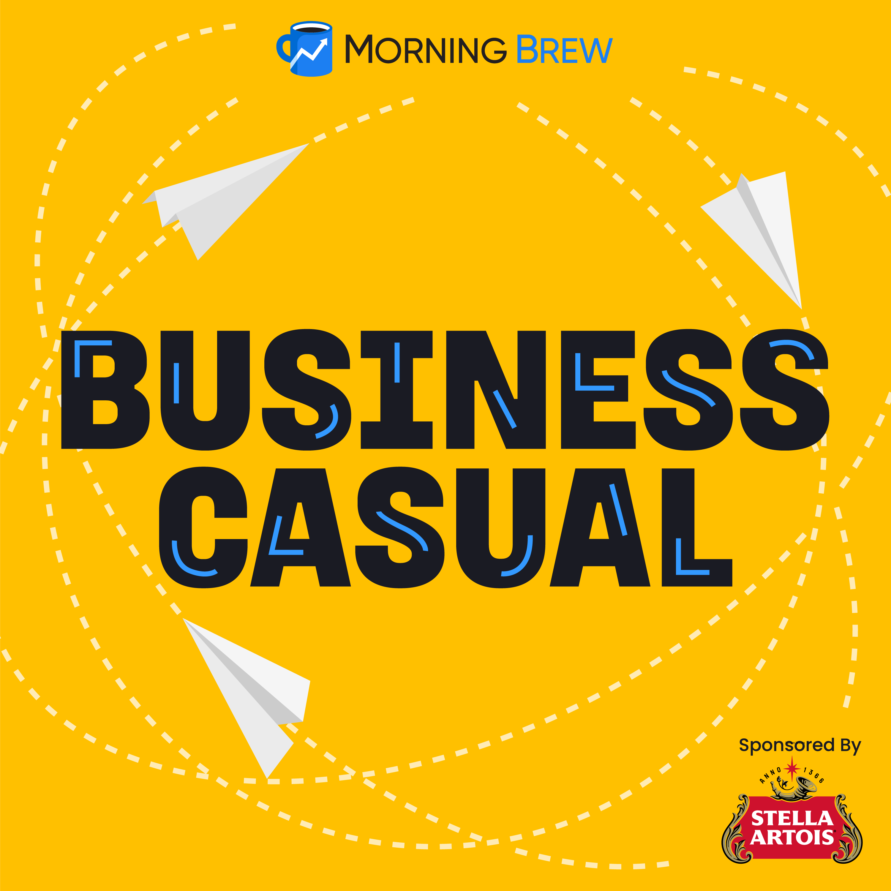
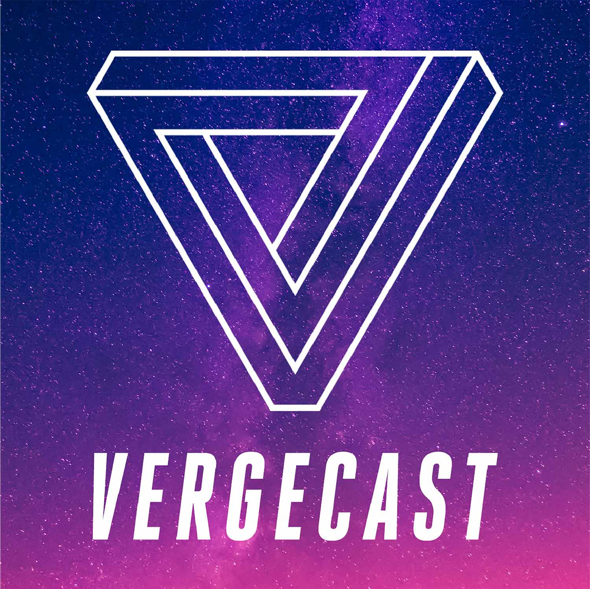
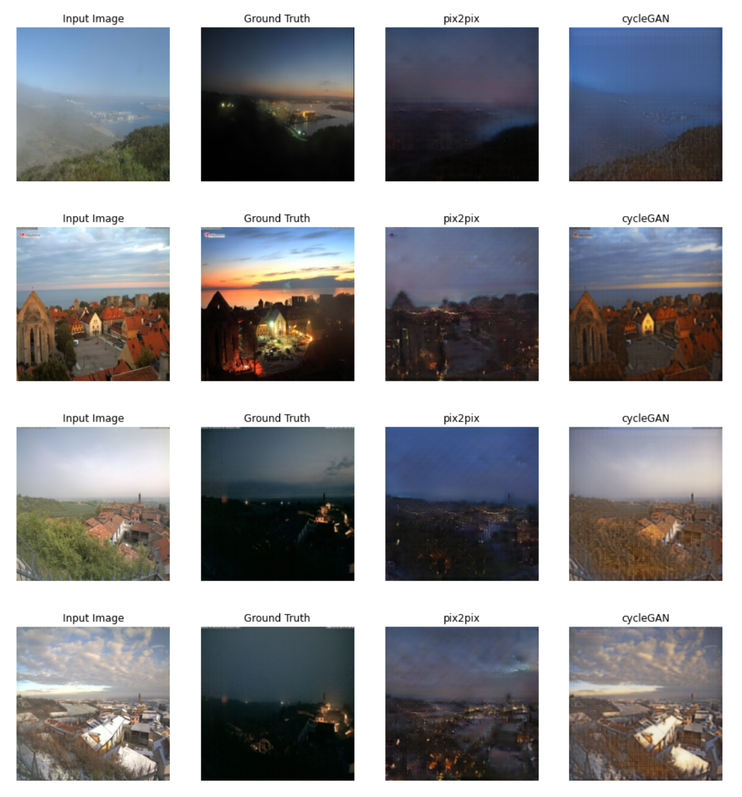
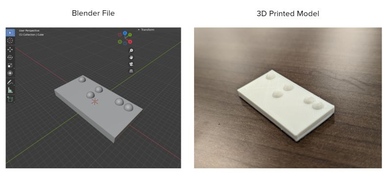
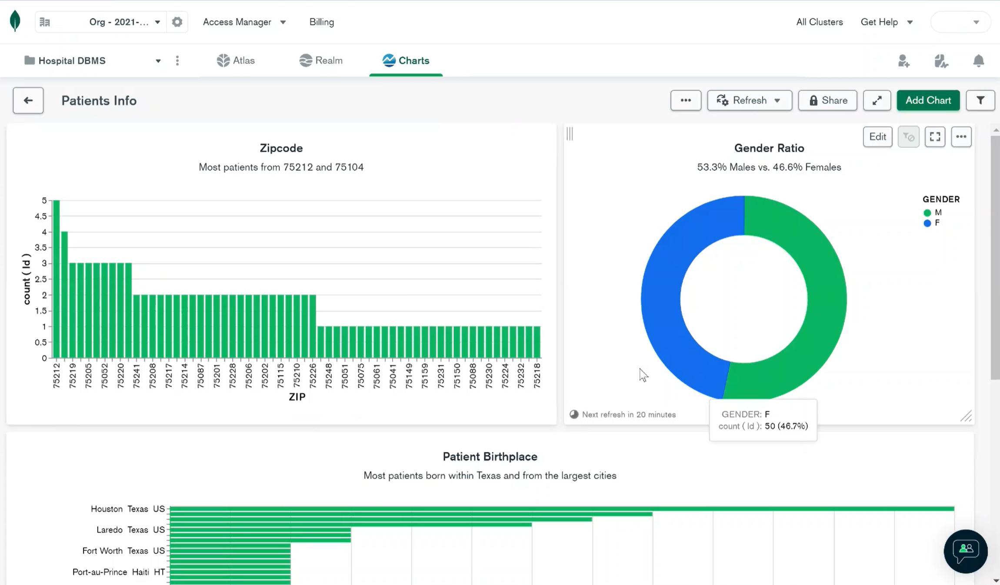
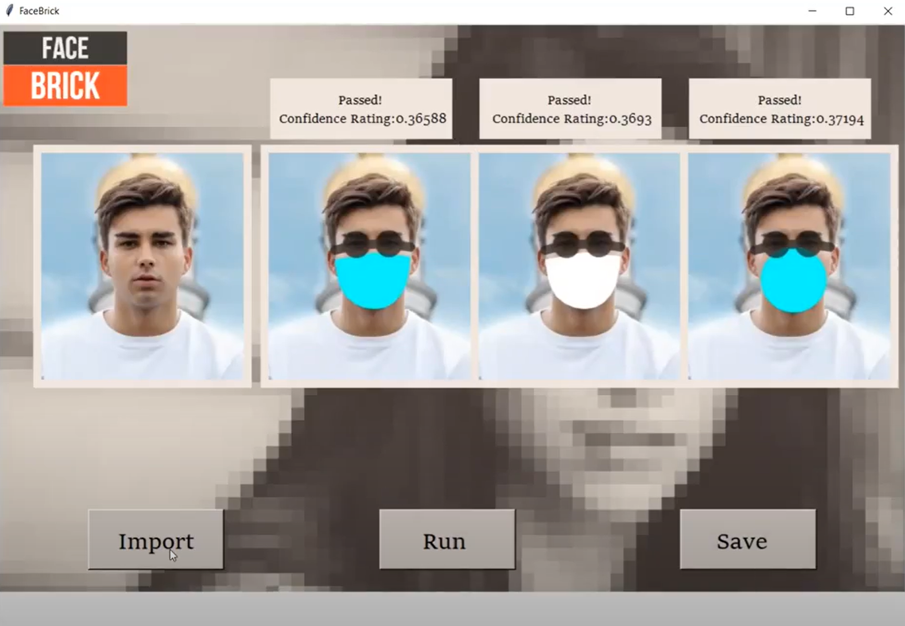

# Howdy

### Who am I?

💻 I'm a graduate student studying Artificial Intelligence and Machine Learning, minoring in Computer Science. Currently interested in ML Deployment, Data Viz, and NLP.

⚕️ My background is in public health, medicine and biochemistry. Ask me about it some time!

🏥 Currently working as a Data Scientist Intern @ [HealthStream](https://www.healthstream.com/) on the AI & Data Outcomes Team. 

 

### What do I like?

☕ A nice cold brew. 

🏃 Running with the dog.

🎵 K-pop jams on repeat.

🎧 Podcasts: 

 

  
 

## PROJECTS:

### ["Vacation for Dummies": A Web App Built Entirely in Python (Anvil)](https://github.com/Coffee-93/vacation_project)

https://user-images.githubusercontent.com/77714442/168207746-d0a30a86-751e-4c9c-8fa9-f340e29a8f41.mp4

* Web application designed for users looking to travel and seeking adventure
* Accepts user preferences and returns a vacation destination

 

### [Day2Night GAN: pix2pix and cycleGAN](https://github.com/codingcloudcowboy/csce5218DLProject)

* Generative Adversarial Networks (GAN) used to convert daytime to nightime images and vice versa
* Both pix2pix and cycleGAN models

 

### [Automatic Braille Translation](https://github.com/CoffeeAddict93/braille_translation)

* Machine learning and computer vision app used to translate text images into 3D printed braille models

 

### [Hospital DBMS – a NoSQL Database and Cloud Deployment](https://github.com/CoffeeAddict93/hospital_DBMS)

* NoSQL database (MongoDB) using synthetic, real-world simulated healthcare data (FHIR/HL7) and cloud deployment along with live dashboards

 

### FaceBrick: An Anti-Facial Recognition App 

* Adversarial AI project; tested limits of Azure’s [FRT](https://azure.microsoft.com/en-us/services/cognitive-services/face/) using computer-generated masks and shades
* 2nd place team in UNT Emerging Scholars Presentation Competition
* (Contact for more info)

 

### [Pulitzer Bot: Text Generation Models Fine-Tuned on Classic Literature](https://github.com/vohuy1894/NLP_Group/wiki)
* Text generation app based on transformers and other NLP models trained on data from Project Gutenberg

### [Telegram Cryptocurrency Analysis](https://github.com/CoffeeAddict93/Telegram_analysis/blob/main/Telegram%20Sentiment%20Analysis%20-%20Crypto%20trends.pdf)
* Streamlit app looking at cryptocurrency trends using real chat data from social media app Telegram

### [Marvin: A Personal Assistant Bot](https://github.com/codingcloudcowboy/marvin_chatbot)
* Personal assistant chatbot; features include sending SMS text messages about medication reminders or checking stocks

### [Insight: Contract Analysis](https://github.com/irinamaystorovich/contract_analysis)
* Extracted entities and summary text using Natural Language Processing and creating a Flask UI to analyze uploaded legal contracts

 

### **Other**

  
  
  

